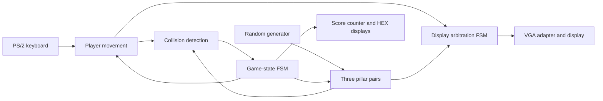

# Glitchy Bird — FPGA Game in Verilog

A bird-and-obstacle arcade game implemented as digital hardware, with VGA graphics, PS/2 keyboard input, collision detection, and seven-segment scoring.

**ECE241 · University of Toronto · 2025**  
**Team:** Ralph Karam and Mujtaniba Islam

## Design highlights

- **Hardware state machines:** start, play, and game-over states coordinate the game; a separate display arbiter grants drawing access to the bird and six pillar objects.
- **VGA rendering:** a 640 × 480 playfield with erase/update/redraw cycles and screen-clearing logic.
- **Keyboard input:** PS/2 input controls vertical bird movement.
- **Procedural obstacles:** three scrolling pillar pairs change gap positions when they wrap around the screen.
- **Collision detection:** bird/pillar overlap and screen boundaries trigger game over.
- **Survival scoring:** elapsed play time is displayed on the board's seven-segment displays.

## Architecture

The implementation coordinates multiple independently moving objects through one display interface. Request/grant signals serialize their drawing operations so the bird and pillars share VGA output.

## Controls

| Input | Action |
| --- | --- |
| `KEY[0]` | Reset |
| `KEY[2]` | Start |
| Hold `W` on the PS/2 keyboard | Move upward |
| Release `W` | Move downward |
| `HEX0`, `HEX1` | Score display |

Avoid the pillars and screen boundaries. After a collision, reset and press Start to play again.

## Reading the source

Start with [`final.v`](final.v), whose top-level module is named `obstacles`. It contains the integrated game logic, game-state transitions, display arbitration, input handling, and obstacle configuration.

The repository also retains development versions in `Obstacles.v`, `obstacle.v`, `testing.v`, and `Player/`, alongside `collision.v` and `random.v`. These files document the development process; do not assume every Verilog file should be compiled together, since development versions can duplicate module definitions.

## Hardware and build status

The design uses the board's `CLOCK_50`, push buttons, LEDs, seven-segment displays, PS/2 connection, and VGA output. Rebuilding it requires an FPGA development board with those interfaces, the matching Quartus device support and pin assignments, and the VGA adapter and initialization assets used for the course project.

This repository is a source-code showcase. A complete, verified Quartus build package and automated simulation procedure are not yet documented here. The source has not been re-synthesized or tested on hardware as part of this portfolio documentation update.

## Engineering lessons

The project presentation documents fixes to pillar geometry, movement-counter direction, and sprite rendering. These issues highlight the interaction between coordinate calculations, control signals, and drawing state machines in a hardware graphics pipeline.

Possible extensions include selectable difficulty, multiple lives, a dedicated game-over screen, and a larger score display.

## Credits

Developed by Ralph Karam and Mujtaniba Islam for ECE241. Board support and VGA adapter dependencies should retain their original course/vendor attribution. The team credit describes the overall project; individual module ownership is not inferred from this overview.
